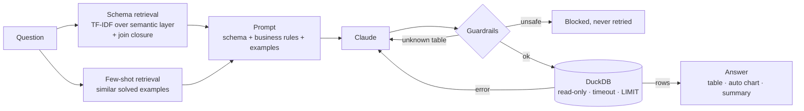

# AI SQL Analyst: Text-to-SQL with Guardrails and an Evaluation Harness


  

Ask a business question in plain English and get back the SQL, the result table, a chart and a one-line answer, from an e-commerce warehouse.

Plenty of text-to-SQL demos exist. This one focuses on the parts that decide whether such a tool can be trusted in a company:

1. **Evaluation.** A 40-question benchmark with gold SQL measures *execution accuracy* across four prompting strategies, separating retrieval failures from generation failures.
2. **Guardrails.** Model-written SQL is treated as untrusted input: static validation, a row limit, a read-only connection with external file access disabled, and a query timeout.
3. **A semantic layer.** Business definitions ("revenue excludes canceled orders") live in one YAML file, so every answer uses the same definition of each metric.

## How it works



| Strategy | Schema in prompt | Few-shot | Self-correction |
|---|---|---|---|
| `zero_shot` | all tables | - | - |
| `retrieval` | retrieved tables | - | - |
| `retrieval_fewshot` | retrieved tables | 3 similar examples | - |
| `full` | retrieved tables | 3 similar examples | up to 2 retries with the DB error |

## Results

### Execution accuracy with Claude
Run `make eval` with your API key; it fills `reports/eval_claude_summary.csv` and `reports/figures/eval_accuracy.png`. Paste the numbers here:

| Strategy | EX (all) | Easy | Medium | Hard | Valid SQL | Avg prompt tokens | Cost / 40 Qs |
|---|---:|---:|---:|---:|---:|---:|---:|
| zero_shot | _run make eval_ | | | | | | |
| retrieval | | | | | | | |
| retrieval_fewshot | | | | | | | |
| full | | | | | | | |

### Verified offline (no API key; reproduced in CI)
- **Schema retrieval recall.** Gold tables are in the prompt for 92.5% of questions at k=1, 95% at k=2 and **100% at k=3**, while sending on average 3 of 6 tables. The retrieval rules (plural stemming, pinned fact table, join closure) are generic, but they were checked on this same benchmark, so treat these numbers as optimistic.
- **Harness correctness.** An oracle model that returns the gold SQL scores 100%. A "noisy oracle" that corrupts ~35% of queries (drops the revenue filter, flips sort order, swaps AVG→SUM, misspells a table) scores 87.5% on the `full` strategy. Every corruption that causes an *execution* error is recovered by self-correction, and every *silent* logic error is caught by the result comparison.
- **25 tests** cover guardrails (DROP, stacked statements, `read_csv('/etc/passwd')`, `ATTACH`, `PRAGMA`, `INSTALL`), result comparison, the retry loop, read-only enforcement and query timeouts.

## Quick start

```bash
git clone https://github.com/Saurav2004aug/ai-sql-analyst.git
cd ai-sql-analyst
pip install -r requirements-dev.txt
make db                                   # demo warehouse -> data/olist.duckdb
export ANTHROPIC_API_KEY=sk-ant-...       # Windows: set ANTHROPIC_API_KEY=...
make app                                  # chat UI  -> http://localhost:8501
make api                                  # REST API -> http://localhost:8000/docs
make eval                                 # benchmark all strategies
```

Using the real Olist data: download it from Kaggle (see the `olist-analytics-warehouse` project) and run `make db-real RAW=path/to/csvs`.

```bash
curl -X POST localhost:8000/ask -H 'Content-Type: application/json' \
     -d '{"question": "Top 5 categories by revenue"}'
```

## Evaluation methodology

- **Execution accuracy (EX).** Run the predicted and gold SQL and compare result sets. Column names and order are ignored, numbers are rounded to 2 decimals, and row order matters only for "top N" questions (`ordered: true`).
- **Relaxed EX.** Extra columns are allowed. Answering "which state is slowest?" with the state *and* its average is still correct.
- **Table recall.** Were the tables the gold query needs in the prompt? If recall is 100% but EX is low, the problem is generation, not retrieval.
- **No test leakage.** Few-shot examples (`semantic/examples.yml`) are separate from benchmark questions.
- Gold SQL is portable (DuckDB and SQLite) and is re-executed against whatever database is loaded, so the benchmark stays valid on the real Kaggle data.

## Guardrails in detail

| Layer | Blocks |
|---|---|
| Static validation | anything but a single SELECT/WITH; write/DDL/admin keywords (`DROP`, `ATTACH`, `COPY`, `PRAGMA`, `INSTALL`, `SET`, ...); file/network table functions (`read_csv`, `read_parquet`, `glob`, ...); `FROM '/path'`; tables outside the semantic catalog. String literals are masked first, so `'drop shipping'` is fine |
| Execution | `SELECT * FROM (...) LIMIT n` wrapper; read-only connection; `enable_external_access=false` in DuckDB; timeout via `interrupt()` / SQLite progress handler |
| Retry policy | execution errors and hallucinated tables are fed back to the model; **security violations are never retried** (error feedback could coach a jailbreak) |

## Project structure

```
├── src/sqlanalyst/
│   ├── agent.py        # prompt building, strategies, self-correction loop
│   ├── catalog.py      # semantic layer, schema + few-shot retrieval
│   ├── guardrails.py   # SQL validation
│   ├── db.py           # read-only DuckDB/SQLite with timeouts
│   ├── llm.py          # Claude client + scripted client for tests
│   ├── evaluate.py     # benchmark harness
│   ├── charts.py       # auto chart selection
│   └── demo_db.py      # builds the warehouse
├── semantic/           # catalog.yml (tables, rules, joins), examples.yml (few-shot bank)
├── benchmark/questions.yml   # 40 questions: 14 easy, 16 medium, 10 hard
├── app/                # streamlit_app.py (chat UI), api.py (FastAPI)
└── tests/
```

## Tech stack

Anthropic Claude API · DuckDB · scikit-learn (TF-IDF retrieval) · Streamlit · FastAPI · pandas · pytest · GitHub Actions

## License

MIT
