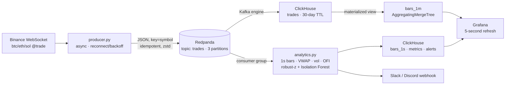
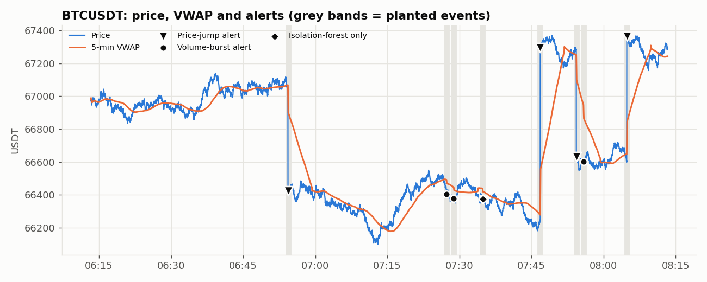
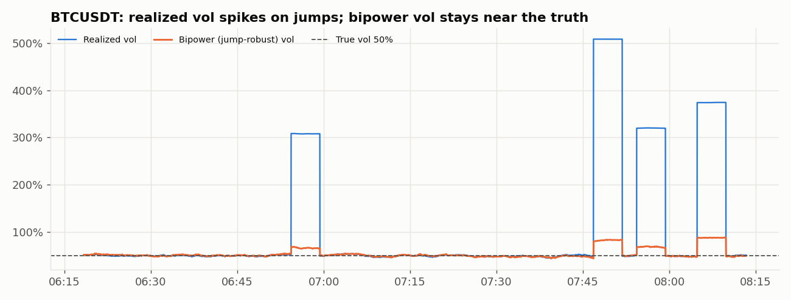

# Real-Time Crypto Market Analytics


   

A streaming analytics platform that ingests **live trades from Binance**, computes market-microstructure metrics **every second**, detects anomalies in real time, and serves everything on a **live Grafana dashboard**. The whole stack starts with a single `docker compose up`.

## Architecture



**Two ingestion paths, on purpose.** ClickHouse consumes the raw topic *itself* via its Kafka engine, and rolls up 1-minute candles in a materialized view at insert time. There's no custom code in that path. The Python service is a second consumer group that does the analytics that SQL can't do well: stateful rolling windows and ML anomaly detection.

## What's computed, every second, per symbol

| Metric | How |
|---|---|
| 1-second OHLCV bars | streaming aggregation, gap-filled, late-trade handling |
| 5-min VWAP & distance from VWAP (bps) | O(1) rolling sums |
| Realized volatility (annualised) | rolling std of 1-second log returns |
| **Bipower variation** (jump-robust vol) | Barndorff-Nielsen & Shephard; RV − BV isolates the jump component |
| Order-flow imbalance | (taker buy − taker sell) / total volume, 1-min window |
| Trade intensity | trades/sec |
| **Anomalies** | rolling **median/MAD** z-scores on returns and volume + a periodically retrained **Isolation Forest**, run as a cheap first stage + expensive second stage, with per-symbol cooldowns |

## Results (offline backtest with planted ground truth)

Every estimator is validated against a market simulator in which the true volatility and the exact timing of price jumps and volume bursts are known ([`reports/backtest.md`](reports/backtest.md)):

| | |
|---|---|
| Throughput | **~38,000 trades/sec on one core** (Binance peaks at ~2k/s for these pairs) |
| Anomaly recall | **100%** of planted price jumps and volume bursts (2-hour run) |
| Anomaly precision | **98%** |
| Vol estimation | realized vol within 1% of truth in normal periods; bipower vol stays close to truth through jumps, while mean realized vol doubles |




**Engineering note.** The first version scored the Isolation Forest on every bar and ran at ~3,800 trades/s. Adding a cheap statistical gate, so only bars that are already unusual reach the forest, made the pipeline **10× faster** and removed its false positives.

## Quick start

Requires Docker Desktop.

```bash
git clone https://github.com/Saurav2004aug/crypto-realtime-analytics.git
cd crypto-realtime-analytics

make up          # live Binance data   (or: docker compose up -d --build)
make up-sim      # simulated market with planted anomalies (works offline)
```

| URL | What |
|---|---|
| http://localhost:3000 | **Grafana dashboard** (opens automatically) |
| http://localhost:8080 | Redpanda Console: topics, partitions, consumer lag |
| http://localhost:8123/play | ClickHouse SQL playground |

Alerts to Slack or Discord: `ALERT_WEBHOOK_URL=https://hooks.slack.com/... make up`

Without Docker, the analytics core runs and tests in plain Python:
```bash
pip install -r requirements-dev.txt
make test        # 11 tests: bars vs batch, vol vs truth, detector precision/recall, throughput
make report      # 2-hour offline backtest -> reports/backtest.md
```

## Example ClickHouse queries

```sql
-- 1-minute candles with VWAP, from the materialized view
SELECT * FROM crypto.bars_1m_v WHERE symbol = 'BTCUSDT' ORDER BY minute DESC LIMIT 10;

-- Jump share of variance over the last hour (realized^2 - bipower^2) / realized^2
SELECT symbol,
       avg(pow(realized_vol_5m, 2) - pow(bipower_vol_5m, 2)) / avg(pow(realized_vol_5m, 2)) AS jump_share
FROM crypto.metrics WHERE ts > now() - INTERVAL 1 HOUR GROUP BY symbol;

-- Alert timeline
SELECT toStartOfFiveMinutes(ts) t, symbol, kind, count() FROM crypto.alerts
GROUP BY t, symbol, kind ORDER BY t DESC;
```

## Design decisions

- **Redpanda instead of Kafka.** It speaks the Kafka API with a single binary and no ZooKeeper/KRaft to manage, so the client code is portable to Confluent/MSK unchanged.
- **Partition key = symbol**, so each symbol's trades stay ordered.
- **At-least-once delivery.** The analytics service writes to ClickHouse *before* committing Kafka offsets, so a crash replays trades rather than losing them.
- **Robust statistics.** Median/MAD z-scores aren't distorted by the spikes they're trying to detect.
- **Transport-agnostic core.** The pipeline takes any iterable of trades, so the same code runs on Kafka, a replay file or the simulator, and is fully unit-testable.

## Project structure

```
├── src/cryptostream/
│   ├── models.py        # Trade / Bar / Metrics / Alert, Binance parser
│   ├── bars.py          # streaming 1-second bar aggregation
│   ├── metrics.py       # O(1) rolling VWAP, RV, bipower, OFI
│   ├── anomaly.py       # robust-z + gated Isolation Forest
│   ├── pipeline.py      # trades -> bars -> metrics -> alerts -> sinks; evaluation
│   ├── simulator.py     # market simulator with ground truth
│   └── io.py            # Redpanda producer/consumer, ClickHouse sink, webhook
├── services/            # producer.py, analytics.py
├── clickhouse/init.sql  # Kafka engine, MergeTree, materialized views
├── grafana/             # provisioned datasource + dashboard (generated by scripts/build_dashboard.py)
├── scripts/offline_report.py
├── tests/test_stream.py
└── docker-compose.yml
```

## Tech stack

Python (asyncio, websockets, NumPy, scikit-learn) · Redpanda (Kafka API) · confluent-kafka · ClickHouse (Kafka engine, materialized views, AggregatingMergeTree) · Grafana · Docker Compose · pytest · GitHub Actions

## License

MIT. Market data © Binance, used via its public market-data API.
