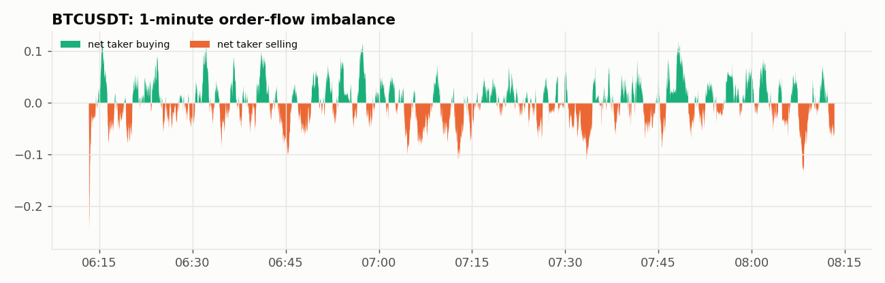

# Offline backtest report

Generated 2026-09-29 13:43 UTC · simulated 120 min of trading · 3 symbols · seed 7

## Throughput
| Trades processed | Bars | Wall time | Throughput |
|---:|---:|---:|---:|
| 375,391 | 21,600 | 9.32 s | **40,287 trades/s** (single core) |

For scale: BTC, ETH and SOL together print roughly 50-2,000 trades/s on Binance, so one analytics process has 20x+ headroom at peak.

## Anomaly detection vs planted events
| Metric | Value |
|---|---:|
| Planted events (price jumps + volume bursts) | 24 |
| Alerts raised | 55 (isolation_forest: 19, price_jump: 12, volume_burst: 24) |
| **Recall** (events detected) | **100%** |
| Recall: price jumps | 100% |
| Recall: volume bursts | 100% |
| **Precision** (alerts that were real events) | **98%** |

## Volatility estimate vs truth
| Symbol | True vol | Median realized vol | Median bipower vol | Mean realized vol | Mean bipower vol |
|---|---:|---:|---:|---:|---:|
| BTCUSDT | 50% | 49.9% | 50.2% | 106.6% | 54.4% |
| ETHUSDT | 65% | 65.3% | 65.3% | 108.5% | 68.4% |
| SOLUSDT | 90% | 90.3% | 91.2% | 155.5% | 95.5% |

