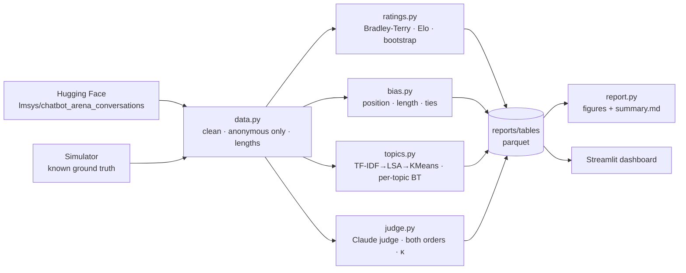

# LLM Evaluation Analytics: Chatbot Arena Deep-Dive


How do you rank large language models fairly from **noisy human preference votes**, and how far can you trust the voters, or an LLM acting as a judge?

This project analyses the public **LMSYS Chatbot Arena** dataset (~33k anonymous battles, each with a human choosing which of two LLM answers is better). It rebuilds the leaderboard with a statistically sound estimator, quantifies the biases hidden in the votes, and measures how well an LLM judge agrees with humans. These are the same questions RLHF and model-evaluation teams deal with every day.

## What it does

| Stage | Method | Output |
|---|---|---|
| **Ratings** | Bradley-Terry maximum-likelihood fit (vectorised, analytic gradient), compared against order-dependent online Elo | Leaderboard on the Elo scale |
| **Uncertainty** | 200-round bootstrap, 95% CIs, and a *statistical rank* (models whose CIs overlap share a rank) | Honest ranking, not false precision |
| **Position bias** | Binomial test + Wilson CI on first-shown win share | Is seat A favoured? |
| **Length bias** | Win curve by length-ratio decile, plus a **style-controlled** BT model with a length covariate | Which models were "winning by verbosity" |
| **Tie behaviour** | Tie rate vs rating gap | Are ties informative or noise? |
| **Topics** | TF-IDF → LSA → KMeans (or sentence embeddings), then a BT fit per topic | Where the leaderboard changes by task type |
| **LLM-as-judge** | Claude judges sampled battles **in both orders**; Cohen's κ vs humans, position-consistency | Can a model replace human raters? |
| **Delivery** | Static Markdown report + interactive Streamlit/Plotly dashboard, CI-tested pipeline, Docker image | Something a stakeholder can use |

## Architecture



## Quick start

```bash
git clone https://github.com/Saurav2004aug/llm-arena-eval-analytics.git
cd llm-arena-eval-analytics
python -m venv .venv && source .venv/bin/activate     # Windows: .venv\Scripts\activate
pip install -r requirements-dev.txt

make demo     # offline run on simulated data: no downloads, no API key (~10 s)
make app      # open the dashboard at http://localhost:8501
make test     # estimator tests against ground truth
```

### Run on the real Arena data

The dataset is gated. Open [the dataset page](https://huggingface.co/datasets/lmsys/chatbot_arena_conversations), accept the terms, then:

```bash
huggingface-cli login          # paste a read token from huggingface.co/settings/tokens
make run                       # ~33k battles, 200 bootstrap rounds
```

### Add the LLM judge

```bash
export ANTHROPIC_API_KEY=sk-ant-...     # Windows: set ANTHROPIC_API_KEY=...
make judge                               # 300 battles × 2 orders = 600 calls
```

Judge calls are cached to `reports/judge_anthropic.jsonl`, so an interrupted run resumes where it left off and you never pay twice. Without a key the pipeline uses a clearly labelled **mock judge**, whose numbers are placeholders, not findings.

### Docker

```bash
docker build -t arena-eval . && docker run -p 8501:8501 arena-eval
```

## Why the simulator?

Every estimator is validated against a simulator in which the **true** model strengths, position bias and length bias are known. The test suite checks that:

- Bradley-Terry recovers the true ranking (Spearman ρ > 0.97, mean gap error < 25 Elo)
- position bias is detected when present and *not* flagged when absent
- style control moves verbose models down and terse models up (correlation with verbosity < −0.9)
- topic clustering recovers the true topics (adjusted Rand index > 0.7)

This is how you know the analysis is correct before trusting it on real data.

## Results

> The figures currently in `reports/` come from the **simulator** so the repo renders out of the box. After `make run` (and ideally `make judge`), they are regenerated from the real data. Update this section with your real numbers.

| | |
|---|---|
|  |  |
|  |  |

See [`reports/summary.md`](reports/summary.md) for the full auto-generated report.

## Key methodological choices

- **Bradley-Terry over online Elo.** Online Elo depends on the order battles arrive in; BT is a single maximum-likelihood fit over all data, which is why LMSYS switched to it.
- **Ties are half-wins** (target y = 0.5), equivalent to the LMSYS convention of counting a tie as a win for each side.
- **Anonymous battles only.** When voters can see model names, brand preference leaks into the votes.
- **Bootstrap, not asymptotic CIs.** Battles are not uniformly distributed across pairs, so resampling gives more trustworthy intervals.
- **Judge in both orders.** A verdict only counts if it survives swapping A and B. Inconsistent verdicts become ties and are reported as a position-consistency rate.
- **Cohen's κ, not raw agreement.** With ~30% ties, raw agreement flatters a judge. κ corrects for agreement by chance.

## Project structure

```
├── src/arena_eval/
│   ├── data.py        # HF loader, cleaning, simulator, parquet I/O
│   ├── ratings.py     # Bradley-Terry, style control, Elo, bootstrap, win matrices
│   ├── bias.py        # position / length / tie diagnostics
│   ├── topics.py      # prompt clustering + per-topic leaderboards
│   ├── judge.py       # LLM-as-judge (Claude API or mock), κ scoring
│   └── report.py      # matplotlib figures + summary.md
├── scripts/run_pipeline.py
├── app/streamlit_app.py
├── tests/test_pipeline.py
├── reports/           # generated: figures/, tables/, summary.md, metrics.json
├── .github/workflows/ci.yml
├── Dockerfile · Makefile · requirements*.txt
```

## Tech stack

Python 3.11 · pandas · NumPy · SciPy (L-BFGS MLE, binomial tests) · scikit-learn (TF-IDF, LSA, KMeans, Cohen's κ) · Hugging Face `datasets` · Anthropic Claude API · Streamlit · Plotly · matplotlib · pytest · Ruff · GitHub Actions · Docker

## References

- Chiang et al., *Chatbot Arena: An Open Platform for Evaluating LLMs by Human Preference* (2024)
- Zheng et al., *Judging LLM-as-a-Judge with MT-Bench and Chatbot Arena* (2023)
- LMSYS blog, *Does style matter? Disentangling style and substance in Chatbot Arena* (2024)

## License

MIT. The Chatbot Arena dataset has its own license and terms on Hugging Face.
