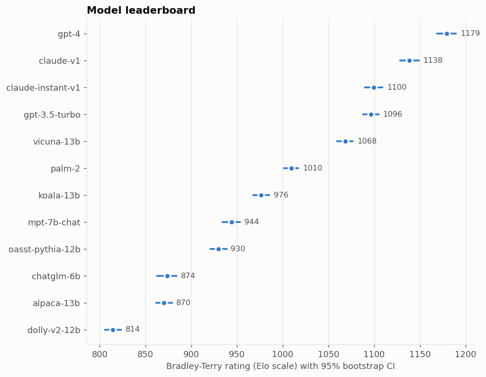
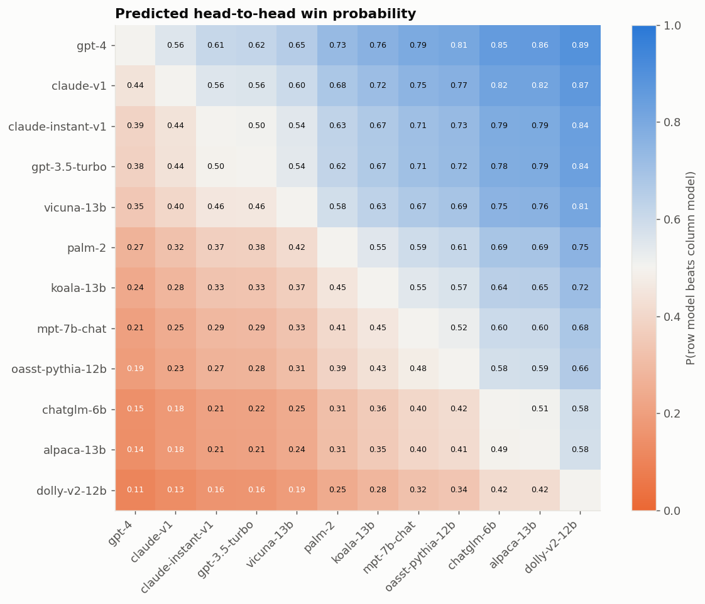
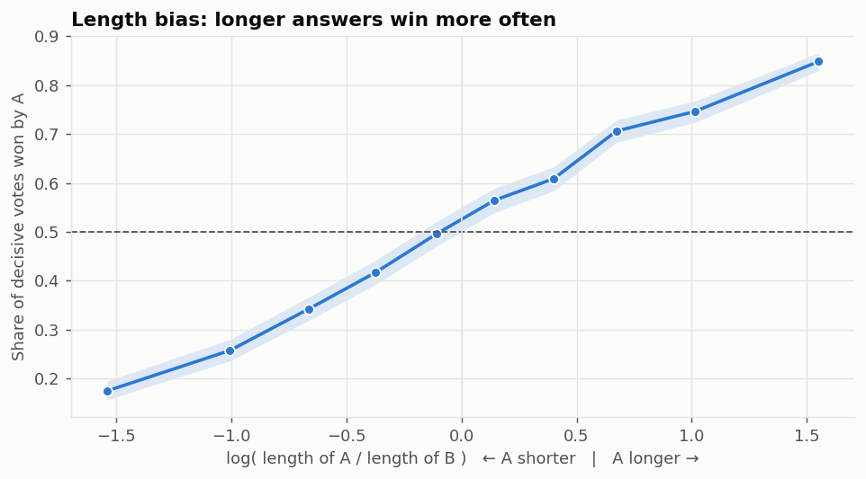
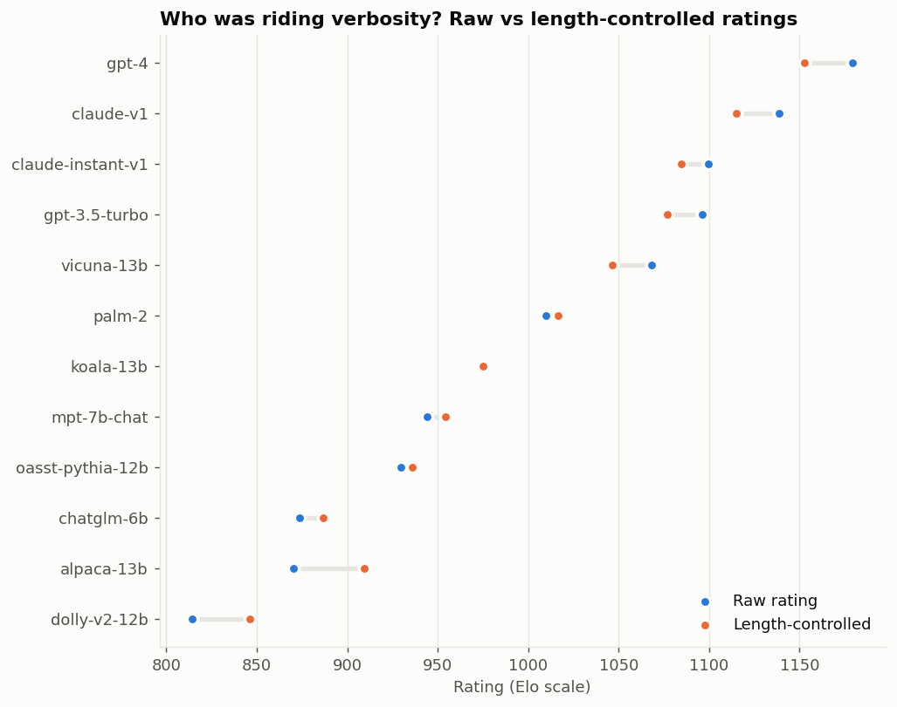
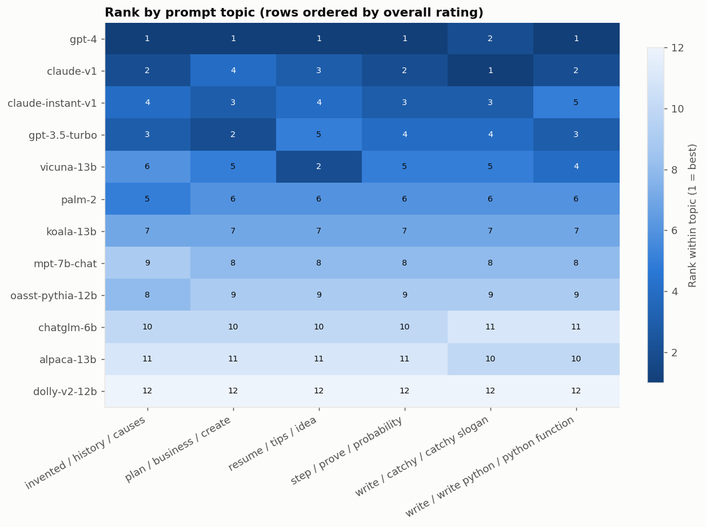
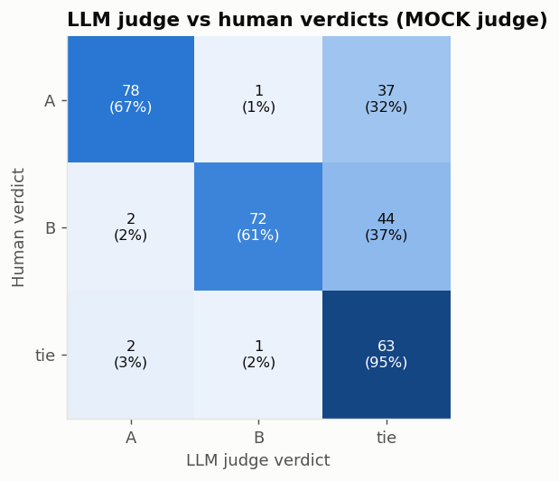

# Chatbot Arena evaluation report

**Source:** synthetic simulator (known ground truth)  ·  **Battles analysed:** 20,000  ·  **Models:** 12  ·  **Bootstrap rounds:** 200

## Key findings
- **Leader:** `gpt-4` at 1179 (95% CI 1168–1190).
- **Position bias:** the first-shown response won 51.6% of decisive votes (95% CI 50.8%–52.4%, p = 7.8e-05).
- **Length bias:** the longer response won 68.1% of decisive votes (p = 0); controlled coefficient = +0.252 logits per SD of length difference.
- **Online Elo vs Bradley-Terry:** Spearman ρ = 0.986 (online Elo is order-dependent; BT is the stable estimator).
- **LLM judge:** agreement 98.0% on decisive votes, Cohen's κ = 0.581, position-consistency 65.7% (n = 300).

> ⚠️ The judge numbers below come from the **offline mock judge** and are placeholders, not findings. Re-run with `--judge anthropic`.
- **Topic clustering quality (simulator only):** adjusted Rand index vs true topics = 0.868.

## Leaderboard (top 10)
|                   |   rating |   ci_low |   ci_high |   rank_ub |
|:------------------|---------:|---------:|----------:|----------:|
| gpt-4             |   1179.4 |   1167.9 |    1190.3 |         1 |
| claude-v1         |   1138.5 |   1127.4 |    1149.7 |         2 |
| claude-instant-v1 |   1099.6 |   1089.2 |    1109.9 |         3 |
| gpt-3.5-turbo     |   1096.2 |   1087   |    1105.5 |         3 |
| vicuna-13b        |   1068.3 |   1058.6 |    1077.4 |         5 |
| palm-2            |   1009.6 |   1000.4 |    1017.9 |         6 |
| koala-13b         |    976.2 |    966.8 |     986.2 |         7 |
| mpt-7b-chat       |    944.1 |    933.4 |     954.1 |         8 |
| oasst-pythia-12b  |    929.8 |    920.3 |     939.4 |         8 |
| chatglm-6b        |    873.8 |    862.1 |     884.9 |        10 |

## Biggest rank changes after length control
|               |   rank |   rank_style_ctrl |   rank_change |   rating_delta |
|:--------------|-------:|------------------:|--------------:|---------------:|
| chatglm-6b    |     10 |                11 |            -1 |           12.9 |
| alpaca-13b    |     11 |                10 |             1 |           39.4 |
| gpt-4         |      1 |                 1 |             0 |          -26.5 |
| claude-v1     |      2 |                 2 |             0 |          -23.2 |
| gpt-3.5-turbo |      4 |                 4 |             0 |          -19.3 |

## Figures

