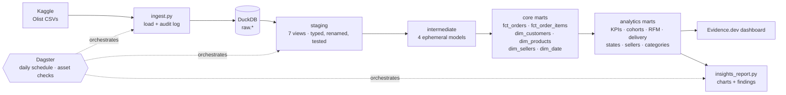

# Olist E-commerce Analytics Warehouse


  

A production-style **modern data stack** built on the Brazilian Olist marketplace dataset (~100k orders, 9 related tables): raw CSVs are loaded into DuckDB, modelled with **dbt** into a tested **star schema**, orchestrated with **Dagster**, and served through a **BI-as-code dashboard** (Evidence.dev) and an automated insights report.

The business question: **what drives revenue and customer satisfaction on a marketplace, and where should the company act?**

## Architecture



| Layer | What happens | Materialisation |
|---|---|---|
| `raw` | CSVs loaded exactly as delivered (all `varchar`) + `_load_audit` table with row counts and MD5 checksums | table |
| `staging` | One model per source: types cast, columns renamed, typos fixed (`lenght` → `length`), categories translated | view |
| `intermediate` | Payments, reviews (deduplicated to latest), basket summaries, customer order sequence | ephemeral |
| `core` | Star schema: `fct_orders` (order grain), `fct_order_items` (**incremental**), 4 dimensions incl. a date spine | table |
| `analytics` | 7 business marts consumed by the dashboard | table |

## Data quality

**~80 data tests** run on every build:
- generic tests: `unique`, `not_null`, `accepted_values`, `relationships` (every fact → dimension FK)
- custom generic tests: `non_negative`, `is_between`
- singular tests: revenue reconciles between the fact and the monthly mart; no delivery before purchase; cohort month 0 = 100%; payments match order value (warn-level, since Olist has known voucher-rounding mismatches)

The dbt project also ships an **offline SQLite harness** (`tests/dbt_sqlite_harness.py`). It renders the real model SQL with Jinja and runs every model and test on SQLite. This means the model logic can be tested on any machine with only Python, and a pytest suite proves the tests actually **catch** corrupted data.

## Key findings

> Numbers in `reports/` are from the synthetic dataset so the repo renders out of the box. Run the pipeline on the real Kaggle data (below) and update this section.

1. **Delivery drives satisfaction.** Late orders average about 2.5★ vs about 4.3★ when on time, and roughly half of late orders get 1★.
2. **Retention is the growth gap.** Most customers never order a second time; month-1 retention is around 1%.
3. **Geography.** Delivery takes 2× longer in the North/Northeast than in São Paulo.


See [`reports/insights.md`](reports/insights.md) for the full report and recommendations.

## Quick start

```bash
git clone https://github.com/Saurav2004aug/olist-analytics-warehouse.git
cd olist-analytics-warehouse
python -m venv .venv && source .venv/bin/activate     # Windows: .venv\Scripts\activate
pip install -r requirements-dev.txt
```

**Option A: real data** (free Kaggle account; put your API token in `~/.kaggle/kaggle.json`):
```bash
make download      # downloads Olist from Kaggle and loads it into warehouse/olist.duckdb
make build         # dbt build: seeds + 24 models + ~80 tests
make report        # reports/insights.md + charts
```

**Option B: offline demo** (no account needed):
```bash
make synthetic ingest build report
```

Then:
```bash
make docs          # dbt docs with the full lineage graph
make dagster       # Dagster UI: asset graph, run history, daily 06:00 IST schedule
make dashboard     # Evidence.dev dashboard (needs Node.js 18+)
make test          # model-logic tests on the SQLite harness
```

Windows users without `make` can run the commands in the `Makefile` directly.

### Run on MotherDuck (cloud)
The `prod` target in `dbt/profiles.yml` points at MotherDuck. Set `MOTHERDUCK_TOKEN` and run `dbt build --target prod`. The same models run unchanged.

## Project structure

```
├── ingestion/
│   ├── ingest.py                 # Kaggle download + DuckDB load + audit log
│   └── generate_synthetic.py     # Olist-schema demo data with planted effects
├── dbt/
│   ├── models/staging/           # 7 stg_ models + sources + tests
│   ├── models/intermediate/      # 4 int_ models
│   ├── models/marts/core/        # star schema
│   ├── models/marts/analytics/   # 7 business marts
│   ├── macros/cross_db.sql       # adapter.dispatch macros (DuckDB / SQLite)
│   ├── tests/                    # singular + custom generic tests
│   └── seeds/                    # Brazilian state → region
├── orchestration/definitions.py  # Dagster assets, asset checks, schedule
├── evidence/                     # dashboard pages + source queries
├── analysis/insights_report.py   # charts + findings
├── tests/                        # SQLite harness + pytest suite
└── .github/workflows/ci.yml      # generate → load → dbt build → pytest → report → sqlfluff
```

## Tech stack

DuckDB · MotherDuck · dbt Core (dbt-duckdb) · Dagster + dagster-dbt · Evidence.dev · Python (pandas, matplotlib) · SQLFluff · pytest · GitHub Actions

## Design decisions

- **`customer_unique_id`, not `customer_id`.** Olist issues a new `customer_id` for every order, so naive analyses report 0% repeat customers. `dim_customers` is keyed on the real person.
- **Latest review wins.** Some orders have several reviews; `int_order_reviews` keeps the most recent one, and a test checks it.
- **Revenue excludes canceled/unavailable orders**, defined once in `fct_orders` and reconciled by a singular test.
- **Frequency uses fixed buckets in RFM.** With ~97% one-time buyers, quintiles would be meaningless.
- **Cross-database macros via `adapter.dispatch`**, so porting to Snowflake or BigQuery means adding one macro variant.

## License

MIT. The Olist dataset is published on Kaggle under CC BY-NC-SA 4.0.
