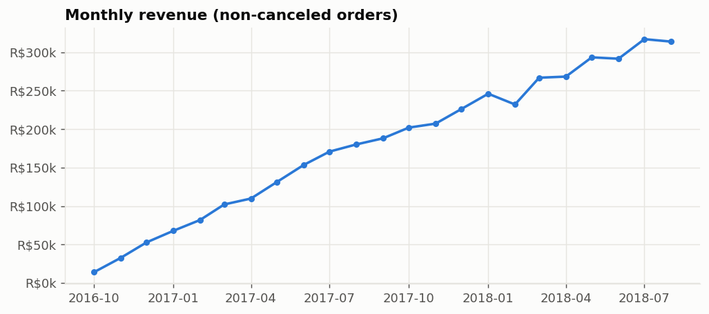
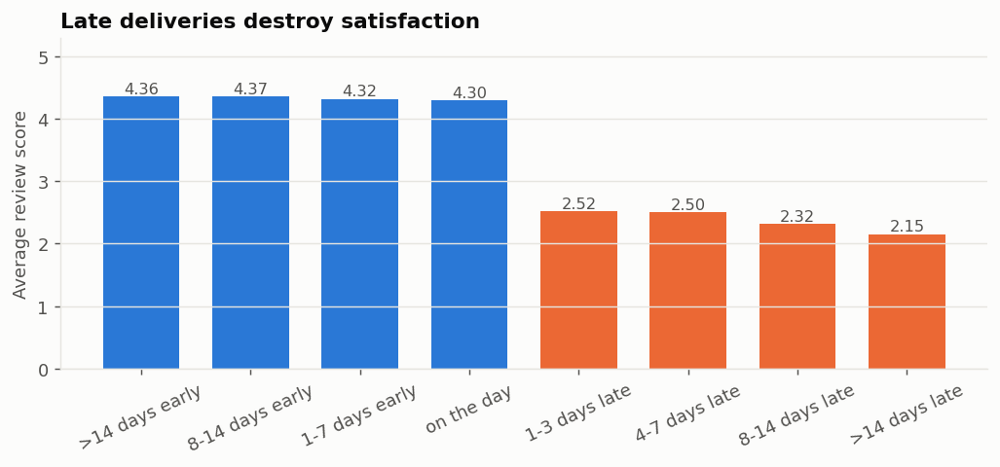
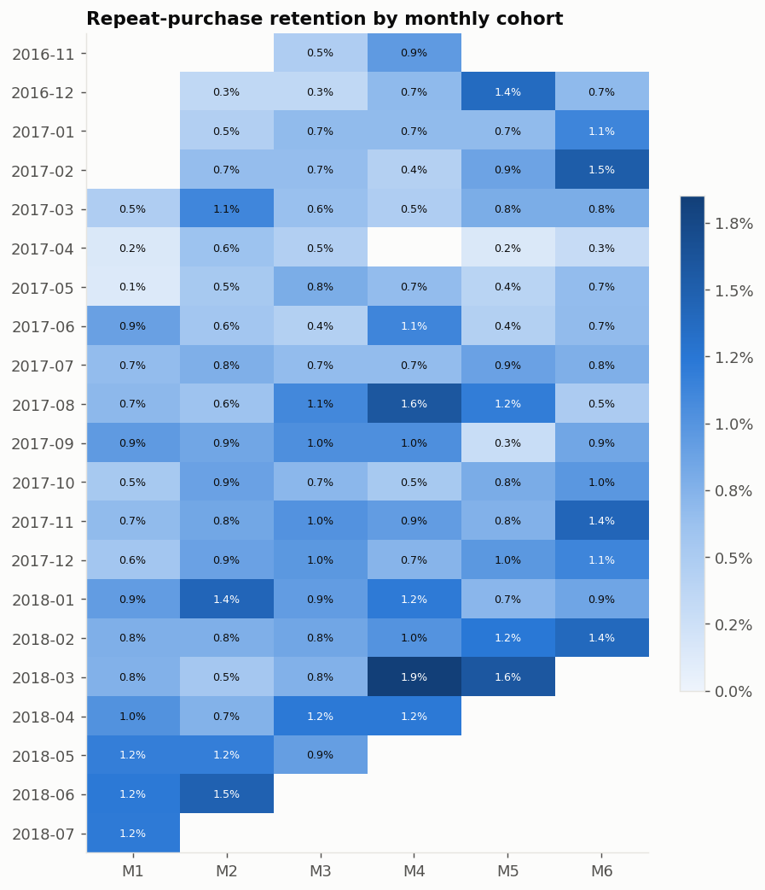
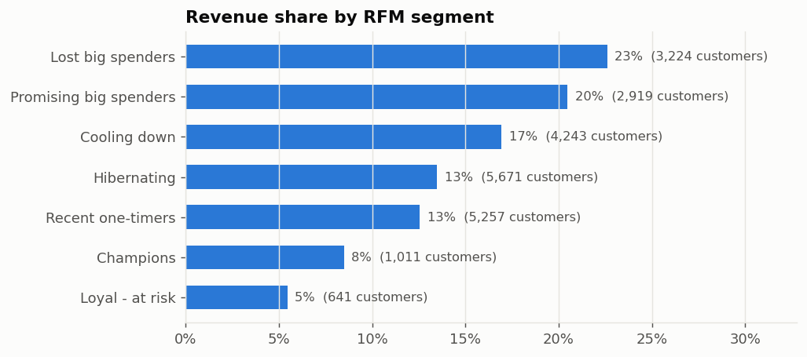
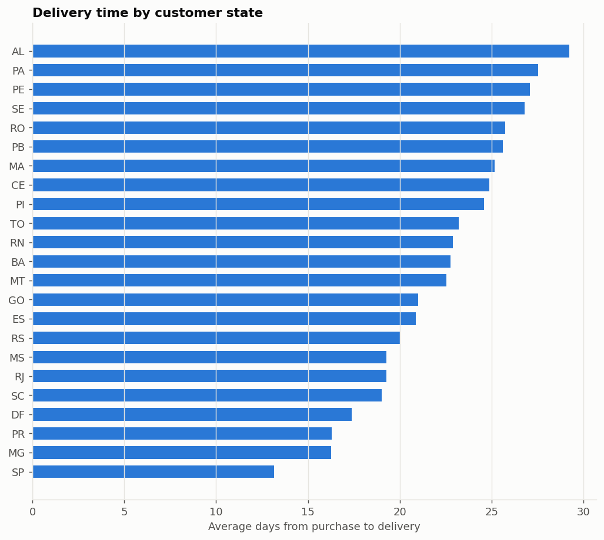

# Olist marketplace: insights report

_Built from the `sqlite` warehouse. Every number below comes from the dbt marts._

## Headline findings
1. **Delivery is the #1 driver of satisfaction.** Late orders average **2.45★** vs **4.35★** for on-time orders, and **48%** of late orders get 1★ (vs 6%).
2. **Retention is the growth gap.** Only **7.2%** of customers ever order twice; month-1 retention is **0.82%**. Growth is almost entirely acquisition-driven.
3. **Revenue concentration.** The top 3 categories (health_beauty, computers_accessories, sports_leisure) generate **29%** of revenue.
4. **Geography matters.** Delivery takes **13** days in the fastest state (SP) vs **29** in the slowest (AL).
5. **Last 12 months:** revenue R$3.05M, 18,195 orders, AOV R$168, late-delivery rate 7.2%.

## Recommendations
- Tighten delivery estimates / carrier SLAs for the slowest states: every late order costs roughly 1.9 review stars.
- Launch a second-purchase programme (post-delivery voucher, category cross-sell) aimed at "Recent one-timers" and "Promising big spenders".
- Put "Needs attention" sellers from `mart_seller_scorecard` on a shipping-time improvement plan.

## Charts

